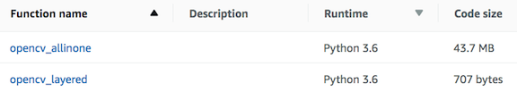
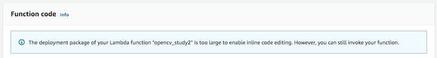

# AWS Lambda function for OpenCV

This project illustrates how to create an AWS Lambda function using Python 3.7 and OpenCV (latest) to grayscale an image in S3 and save it back to S3. The Python OpenCV library can be published together with the application code as an all-in-one Lambda function, or as a Lambda layer which reduces the size of the Lambda function and enables the function code to be rendered in the Lambda code viewer in the AWS console. Both deploy options are described in USAGE. The respective sizes of these deployments are shown below:



## USAGE:

### Preliminary AWS CLI Setup: 
1. Install [Docker](https://docs.docker.com/), the [AWS CLI](https://aws.amazon.com/cli/), and [jq](https://stedolan.github.io/jq/) on your workstation.
2. Setup credentials for AWS CLI (see http://docs.aws.amazon.com/cli/latest/userguide/cli-chap-getting-started.html).
3. Create IAM Role with Lambda and S3 access:
```
# Create a role with S3 and Lambda exec access
ROLE_NAME=lambda-opencv_study
aws iam create-role --role-name $ROLE_NAME --assume-role-policy-document '{"Version":"2012-10-17","Statement":{"Effect":"Allow","Principal":{"Service":"lambda.amazonaws.com"},"Action":"sts:AssumeRole"}}'
aws iam attach-role-policy --policy-arn arn:aws:iam::aws:policy/AmazonS3FullAccess --role-name $ROLE_NAME
aws iam attach-role-policy --policy-arn arn:aws:iam::aws:policy/service-role/AWSLambdaBasicExecutionRole --role-name $ROLE_NAME
```

### Build OpenCV library using Docker

AWS Lambda functions run in an [Amazon Linux environment](https://docs.aws.amazon.com/lambda/latest/dg/current-supported-versions.html), so libraries should be built for Amazon Linux. You can build Python-OpenCV libraries for Amazon Linux using the provided Dockerfile, like this:

```
git clone https://github.com/iandow/opencv_aws_lambda
cd opencv_aws_lambda
docker build --tag=lambda-layer-factory:latest .
docker run --rm -it -v $(pwd):/data lambda-layer-factory cp /packages/cv2-python37.zip /data
```

### Deploy Option #1 - Lambda function with dependencies included.

***NOTE! [Deploy Option #2](https://github.com/iandow/opencv_aws_lambda#deploy-option-2-preferred---lambda-function-with-libraries-as-lambda-layers) is better. Do that one.***

1. Edit the Lambda function code to do whatever you want it to do.
```
vi app.py
```

2. Combine Python libraries and app.py into a single all-in-one ZIP file
```
ZIPFILE=allinone.zip
unzip cv2-python37.zip 
cp app.py python/lib/python3.7/site-packages/
cd python/lib/python3.7/site-packages/
zip -r9 ../../../../$ZIPFILE .
cd -
```

3. Deploy the Lambda function:
```
# Create the Lambda function:
FUNCTION_NAME=opencv_allinone
ACCOUNT_ID=$(aws sts get-caller-identity | jq -r ".Account")
BUCKET_NAME=opencv-test
aws s3 mb s3://$BUCKET_NAME
S3_KEY=images/my_image.jpg
aws s3 cp $ZIPFILE s3://$BUCKET_NAME
aws lambda create-function --function-name $FUNCTION_NAME --timeout 10 --role arn:aws:iam::${ACCOUNT_ID}:role/$ROLE_NAME --handler app.lambda_handler --region us-west-2 --runtime python3.7 --environment "Variables={BUCKET_NAME=$BUCKET_NAME,S3_KEY=$S3_KEY}" --code S3Bucket="$BUCKET_NAME",S3Key="$ZIPFILE"
```

The problem with the all-in-one approach is that it results in a larger zip file. In this case, allinone.zip is 43.7MB. Since it exceeds 3MB you can't use the code editor in the AWS Lambda web user interface on http://console.aws.amazon.com/lambda/. If you try, then you'll see this error:



If using that code editor is important to you then deploy with the procedure described in the next section, [Deploy Option #2](https://github.com/iandow/opencv_aws_lambda#deploy-option-2-preferred---lambda-function-with-libraries-as-lambda-layers).

### Deploy Option #2 (preferred) - Lambda function with libraries as Lambda layers.

1. Edit the Lambda function code to do whatever you want it to do.
```
vi app.py
```

2. Publish the OpenCV Python library as a Lambda layer.
```
ACCOUNT_ID=$(aws sts get-caller-identity | jq -r ".Account")
LAMBDA_LAYERS_BUCKET=lambda-layers-$ACCOUNT_ID
LAYER_NAME=cv2
aws s3 mb s3://$LAMBDA_LAYERS_BUCKET
aws s3 cp cv2-python37.zip s3://$LAMBDA_LAYERS_BUCKET
aws lambda publish-layer-version --layer-name $LAYER_NAME --description "Open CV" --content S3Bucket=$LAMBDA_LAYERS_BUCKET,S3Key=cv2-python37.zip --compatible-runtimes python3.7
```

3. Create the Lambda function:
```
zip app.zip app.py
```

4. Deploy the Lambda function:
```
# Create the Lambda function:
FUNCTION_NAME=opencv_layered
ACCOUNT_ID=$(aws sts get-caller-identity | jq -r ".Account")
BUCKET_NAME=opencv-test
aws s3 mb s3://$BUCKET_NAME
aws s3 cp app.zip s3://$BUCKET_NAME
aws lambda create-function --function-name $FUNCTION_NAME --timeout 20 --role arn:aws:iam::${ACCOUNT_ID}:role/$ROLE_NAME --handler app.lambda_handler --region us-west-2 --runtime python3.7 --environment "Variables={BUCKET_NAME=$BUCKET_NAME,S3_KEY=$S3_KEY}" --code S3Bucket="$BUCKET_NAME",S3Key="app.zip"
```

7. Attach the cv2 Lambda layer to our Lambda function:
```
LAYER=$(aws lambda list-layer-versions --layer-name $LAYER_NAME | jq -r '.LayerVersions[0].LayerVersionArn')
aws lambda update-function-configuration --function-name $FUNCTION_NAME --layers $LAYER
```

### Test the Lambda function:
Our Lambda function requires an image as input. Copy an image to S3, like this:
```
aws s3 cp ./images/my_image.jpg s3://$BUCKET_NAME/images/my_image.jpg
```
Then invoke the Lambda function:
```
aws lambda invoke --function-name $FUNCTION_NAME --log-type Tail outputfile.txt
cat outputfile.txt
```

You should see output like this:
```
{"statusCode": 200, "body": "{\"message\": \"image saved to s3://$BUCKET_NAME/my_image-gray.jpg\"}"}
```

```
aws s3 cp s3://$BUCKET_NAME/my_image-gray.jpg .
open my_image-gray.jpg
```

 

### Clean up resources
```
aws s3 rm s3://$BUCKET_NAME/my_image-gray.jpg
aws s3 rb s3://$BUCKET_NAME/
aws s3 rm s3://$LAMBDA_LAYERS_BUCKET/cv2-python37.zip
aws s3 rb s3://$LAMBDA_LAYERS_BUCKET
rm my_image-gray.jpg
rm -rf ./app.zip ./python/
aws lambda delete-function --function-name $FUNCTION_NAME
LAYER_VERSION=$(aws lambda list-layer-versions --layer-name cv2 | jq -r '.LayerVersions[0].Version')
aws lambda delete-layer-version --layer-name cv2 --version-number $LAYER_VERSION
aws iam detach-role-policy --policy-arn arn:aws:iam::aws:policy/service-role/AWSLambdaBasicExecutionRole --role-name $ROLE_NAME
aws iam detach-role-policy --policy-arn arn:aws:iam::aws:policy/AmazonS3FullAccess --role-name $ROLE_NAME
aws iam delete-role --role-name $ROLE_NAME
```
